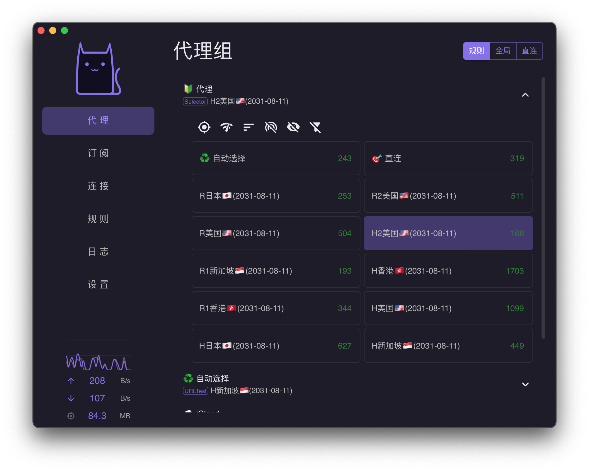
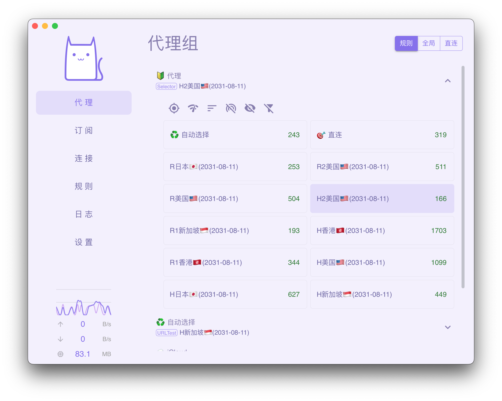

<h1 align="center">
  
  <br>
  Continuation of <a href="https://github.com/zzzgydi/clash-verge">Clash Verge</a>
  <br>
</h1>

<h3 align="center">
A Clash Meta GUI based on <a href="https://github.com/tauri-apps/tauri">Tauri</a>.
</h3>

## Features

- Since the clash core has been removed. The project no longer maintains the clash core, but only the Clash Meta core.
- Profiles management and enhancement (by yaml and Javascript). [Doc](https://github.com/clash-verge-rev/clash-verge-rev/wiki/%E4%BD%BF%E7%94%A8%E6%8C%87%E5%8D%97)
- Simple UI and supports custom theme color.
- Built-in support [Clash.Meta(mihomo)](https://github.com/MetaCubeX/mihomo) core.
- System proxy setting and guard.

#### TG Group: [@clash_verge_rev](https://t.me/clash_verge_rev)

## Preview




## Install

Download from [release](https://github.com/fun90/clash-verge-rev/releases). Supports Windows x64, Linux x86_64 and macOS 11+

- [Windows x64](https://github.com/fun90/clash-verge-rev/releases/download/v1.4.0/Clash.Verge_1.4.0_x64_zh-CN.msi)
- [macOS intel](https://github.com/fun90/clash-verge-rev/releases/download/v1.4.0/Clash.Verge_1.4.0_x64.dmg)
- [macOS arm](https://github.com/fun90/clash-verge-rev/releases/download/v1.4.0/Clash.Verge_1.4.0_aarch64.dmg)
- [Linux AppImage](https://github.com/fun90/clash-verge-rev/releases/download/v1.4.0/clash-verge_1.4.0_amd64.AppImage)
- [Linux deb](https://github.com/fun90/clash-verge-rev/releases/download/v1.4.0/clash-verge_1.4.0_amd64.deb)

Or you can build it yourself. Supports Windows, Linux and macOS 10.15+

Notes: If you could not start the app on Windows, please check that you have [Webview2](https://developer.microsoft.com/en-us/microsoft-edge/webview2/#download-section) installed.

### FAQ

#### 1. **macOS** "Clash Verge" is damaged and can't be opened

open the terminal and run `sudo xattr -r -d com.apple.quarantine /Applications/Clash\ Verge.app`

## Development

You should install Rust and Nodejs, see [here](https://tauri.app/v1/guides/getting-started/prerequisites) for more details. Then install Nodejs packages.

```shell
pnpm i
```

Then download the clash binary... Or you can download it from [clash meta release](https://github.com/MetaCubeX/Clash.Meta/releases) and rename it according to [tauri config](https://tauri.studio/docs/api/config/#tauri.bundle.externalBin).

```shell
# force update to latest version
# pnpm run check --force

pnpm run check
```

Then run

```shell
pnpm dev

# run it in another way if app instance exists
pnpm dev:diff
```

Or you can build it

```shell
pnpm build
```

## Todos

> This keng is a little big...

## Disclaimer

This is a learning project for Rust practice.

## Contributions

Issue and PR welcome!

## Acknowledgement

Clash Verge rev was based on or inspired by these projects and so on:

- [zzzgydi/clash-verge](https://github.com/zzzgydi/clash-verge): A Clash GUI based on tauri. Supports Windows, macOS and Linux.
- [tauri-apps/tauri](https://github.com/tauri-apps/tauri): Build smaller, faster, and more secure desktop applications with a web frontend.
- [Dreamacro/clash](https://github.com/Dreamacro/clash): A rule-based tunnel in Go.
- [MetaCubeX/mihomo](https://github.com/MetaCubeX/mihomo): A rule-based tunnel in Go.
- [Fndroid/clash_for_windows_pkg](https://github.com/Fndroid/clash_for_windows_pkg): A Windows/macOS GUI based on Clash.
- [vitejs/vite](https://github.com/vitejs/vite): Next generation frontend tooling. It's fast!

## License

GPL-3.0 License. See [License here](./LICENSE) for details.
